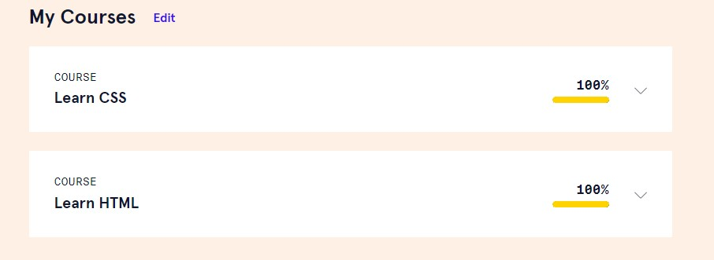

# kottans-frontend

## 1. Git та Github

Сподовався курс **Version Control with Git**. Дуже толково описано. Навіть не помітив як пройшов ще один курс **Shell Workshop**.

Що я для себе виділив з цього курсу:
  - Для мене нове, що в Google Docs є VC;
  - Здивувало, що робота з Git простіша ніж я собі представляв;
  - Обов'язково буду використовувати `git checkout -b branchName`.

## 2. Linux CLI, and HTTP

### Linux CLI
Дуже сподобався курс. Все зрозуміло і доступно роз'яснюється на практиці.
  - Нове майже все, бо не був активним користувачем терміналу;
  - Здивувало, що робота через термінал можна подивитись, який з прінтерів зараз друкує (серйозно, здивувало!);
  - Тепер буду використовувати як мінімум базові команди як: `cd`, `cp`, `ls`, `mv` etc.

### HTTP (Частина 1)

Дуже детальна інформація про протокол HTTP (хоча, якщо чесно, в якийсь момент зрозумів, що нічого не розумію, але зробив перерву і "вирівнявся").
  - Практично весь матеріал був новий для мене, тому не можу виділити щось конкретне;
  - Здивувавало також все (матеріал же ж новий);
  - Почитав ще про jQuery і хотів би спробувати використати її на практиці.

### HTTP (Частина 2)

Цей матеріал був більш легкий для осмислення. Скоріше всього, Частина 1 цьому допомогла. 
 - Та ж сама історія. Майже весь матеріал новий. Але, звісно, є знайомі терміни (як і для всіх, хто не перший день користується інтернетом);
 - Здивувало те, як сильно відрізняються http і https (не тільки буквою :sweat_smile:);
 - А от далі побачим, що саме буду використовувати!

## 3. Git Collaboration

Пройшов курс [Introduction to Git and GitHub](https://www.coursera.org/learn/introduction-git-github). Дуже простий в розумінні, що полегшує подальший розвиток в роботі з Git. Також завершив наступні рівні в [learngitbranching](https://learngitbranching.js.org/):

 - Для мене нове, що в `git push` та `git fetch` можна передавати аргументи;
 - Мене здивувало, що за допомогою `git push origin` можна видаляти гілку, а за допомогою `git fetch` - створити гілку в локальному репозиторії;
 - Буду користуватися аргументами в `git push` і `git fetch`, бо це реально зручно!

## 4. Intro to HTML and CSS

Прослухав тижні 1 і 2 курсу [HTML, CSS, and Javascript for Web Developers](https://www.coursera.org/learn/html-css-javascript-for-web-developers). Гарна подача матеріалу! Також пройшов курс [Learn HTML](https://www.codecademy.com/learn/learn-html) та [Learn CSS](https://www.codecademy.com/learn/learn-css). Сподобалось, що майже після кожного завдання є практичне завдання.

  - З нового не можу нічого виділити, бо до цього вже був знайомий з HTML та CSS.
  - Здивувало, що можна надавати стилі атрибутам.
  - Буду використовувати Bootstrap. Дуже прикольний фреймворк.

## 5. Responsive Web Design

### Responsive web design basics
Дуже цікава [стаття](https://web.dev/i18n/ru/responsive-web-design-basics/) про те, як краще робити адаптивний дизайн.
 - Не сказав би, що дізнався щось кардинально нове. Але відкрив для себе багато нюансів, на які потрібно звертати увагу при розробці.
 - Здивувало, що адаптивний дизайн - це дуже кропітка робота, при якій потрібно розуміти, чи буде зручно користувачу працювати з веб-застосунком.
  - Буду продивлятися точки зупину :laughing:

### FLEXBOX. Вчимося верстати на флексах
Дуже корисний модуль, який спрощує роботу. Сподобалась подача матеріалу. Тепер з задоволенням буду слідкувати за цим [каналом](https://www.youtube.com/c/FreelancerLifeStyle).
  - Весь матеріал був новий.
  - Буду використовувати `flex-flow` там, де потрібно вказати `flex-direction` і `flex-wrap`.

### Flexbox Froggy
Прикольна гра, яка допомагає закріпити матеріал по флексах.

### CSS Grid Layout
Гріди - це модуль для створення шаблонів веб-сторінки. Відмінність від Flexbox в тому, що з грідами можна позиціонувати елементи в двох напрямках: в колонках і в рядках.
 - Так само, як і флекси, гріди для мене нова тема.
 - Здивувало, яким чином задається сітка.
 - Буду розбиратись в `grid-templates`

### [Grid Garden](http://cssgridgarden.com/#ua)
Гра для закріплення знань по CSS Grid. 

